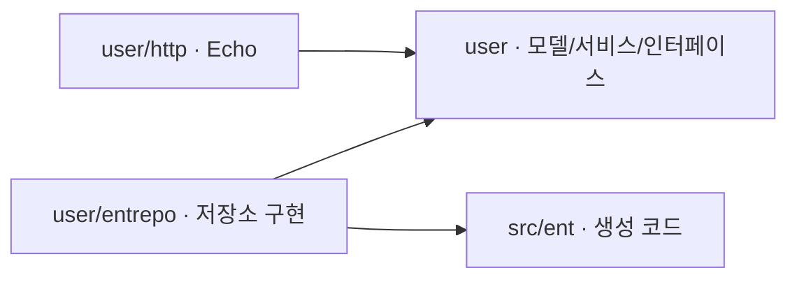

# Echo + Ent 클린 아키텍처 예제

애플리케이션 코드를 모두 `src/` 아래에 둔 회원 API 예제입니다.
Echo v5는 HTTP 입출력, Ent는 DB 접근을 담당하며, 회원 서비스는 두 라이브러리를 import하지 않습니다.
DB 서버 설치 없이 SQLite 파일로 실행할 수 있습니다.

## 실행

Go 1.26 이상과 CGO용 C 컴파일러가 필요합니다. SQLite 드라이버는
`github.com/mattn/go-sqlite3`를 사용합니다. macOS에서는 Xcode Command Line Tools로 컴파일러를 설치할 수 있습니다.

프로젝트 루트에서 실행합니다.

```bash
go run ./src/cmd/api
```

기본 주소는 `http://127.0.0.1:8080`입니다. 첫 실행 시 현재 작업 디렉터리에
`app.db`와 테이블을 생성하며, 재시작해도 데이터가 남습니다. 생성된 Ent 코드가 포함되어 있어
최초 실행 전에 코드 생성을 따로 할 필요는 없습니다.

환경변수로 주소와 SQLite 연결 문자열을 바꿀 수 있습니다.
`.env` 파일을 자동으로 읽는 기능은 없습니다.

```bash
HTTP_ADDR=127.0.0.1:8081 \
DATABASE_DSN='file:demo.db?_fk=1&_busy_timeout=5000' \
go run ./src/cmd/api
```

`Ctrl+C` 또는 `SIGTERM`으로 종료하면 진행 중인 HTTP 요청을 최대 5초 기다린 뒤 DB 연결을 닫습니다.

## 디렉터리와 읽는 순서

```text
.
├── go.mod
├── go.sum
├── README.md
└── src/
    ├── cmd/api/main.go                 # 설정, DB 연결, 앱 조립 호출, 서버 시작·종료
    ├── ent/
    │   ├── schema/
    │   │   ├── user.go                 # 사용자 DB 스키마
    │   │   └── mixin/time.go           # 생성·수정 시각 공통 필드
    │   ├── generate.go                 # 코드 생성 명령
    │   └── ...                         # 자동 생성된 ORM 코드
    └── internal/
        ├── bootstrap/
        │   ├── application.go         # 기능별 모듈과 API 라우트 연결
        │   └── user_module.go         # 사용자 저장소 → 서비스 → 핸들러 조립
        ├── database/sqlite.go          # SQLite 연결과 예제용 마이그레이션
        ├── httpserver/
        │   ├── router.go               # Echo 초기화, 공통 미들웨어, 상태 확인 라우트
        │   ├── errors.go               # 반환된 error → HTTP 상태와 JSON
        │   └── errors_test.go          # 오류 감싸기, HEAD, 이미 전송된 응답 검증
        └── user/
            ├── user.go                 # 도메인 모델과 가입 입력 규칙
            ├── service.go              # 사용자 생성/조회/비활성화 유스케이스
            ├── repository.go           # 서비스가 소비하는 저장소 인터페이스
            ├── errors.go               # 기능의 오류
            ├── service_test.go         # DB 없이 규칙 검증
            ├── http/
            │   ├── routes.go           # Echo 라우트 등록
            │   ├── handler.go          # 본문 바인딩, 서비스 호출, error 반환
            │   ├── dto.go              # API 요청/응답 타입
            │   └── handler_test.go     # HTTP → 실제 SQLite 통합 테스트
            └── entrepo/
                ├── repository.go      # Ent 쿼리와 DB 오류 변환
                ├── mapper.go          # ent.User → user.User
                └── repository_test.go # 실제 SQLite로 저장소 검증
```

읽는 순서는 `main.go → bootstrap/application.go → bootstrap/user_module.go → user/http/handler.go → user/service.go → user/entrepo/repository.go`를 권장합니다.
각 파일의 한국어 주석에서 경계를 나눈 이유를 설명합니다.

## 의존성과 데이터 흐름

아래 화살표는 Go의 import 방향입니다.



실행 중 서비스는 `user.UserRepository`의 메서드를 호출합니다.
`bootstrap.NewUserModule`이 이 인터페이스에 Ent 구현체를 연결합니다.
핵심 패키지가 저장소 구현을 import하지 않아도 실제 DB를 사용하는 이유입니다.

사용자 기능의 타입과 생성 함수에는 `User`를 명시합니다.

| 생성 함수 | 역할 |
|---|---|
| `user.NewUser` | 가입 입력을 검증하고 `User` 모델 생성 |
| `user.NewUserService` | `UserService` 생성과 저장소 주입 |
| `entrepo.NewUserRepository` | `user.UserRepository` 인터페이스의 Ent 구현체 생성 |
| `userhttp.NewUserHandler` | `UserHandler` 생성과 서비스 주입 |
| `bootstrap.NewUserModule` | 사용자 저장소·서비스·핸들러 조립 |
| `bootstrap.NewApplication` | 기능별 모듈과 API 라우트 연결 |

`bootstrap/user_module.go`에서 사용자 기능의 내부 의존성을 연결합니다.

```go
userRepository := entrepo.NewUserRepository(entClient)
userService := user.NewUserService(userRepository)
userHandler := userhttp.NewUserHandler(userService)
```

`bootstrap/application.go`에서는 모듈을 생성하고 라우트를 등록합니다.

```go
userModule := NewUserModule(entClient)
router := httpserver.New()
api := router.Group("/api/v1")
userModule.UserHandler.RegisterRoutes(api)
```

`main.go`는 `bootstrap.NewApplication(client)`을 호출하고 반환된
`application.Router`로 HTTP 서버를 실행합니다.
DB 클라이언트는 main에서 한 번 열고, HTTP 서버가 종료된 뒤 닫습니다.
bootstrap은 전달받은 클라이언트로 객체를 연결하며 요청별 Context나 트랜잭션을 보관하지 않습니다.

현재 기능 모듈은 사용자 하나입니다. 주문·결제 기능을 추가할 때에는
`bootstrap/order_module.go`, `bootstrap/payment_module.go`에 각 조립 함수를 두고
`application.go`에서 모듈 간 의존성과 라우트를 연결하면 됩니다.
다른 기능이 사용자 서비스가 필요할 때에는 `userModule.UserService`를
해당 기능이 요구하는 작은 인터페이스로 전달합니다.
`Application` 전체를 업무 서비스에 주입하지 않습니다.

사용자 생성은 다음 순서로 처리됩니다.

1. 핸들러가 `echo.BindBody`로 JSON을 `createRequest`에 바인딩합니다.
2. 서비스가 이름·이메일을 검증하고 `user.User`를 만듭니다.
3. 저장소가 Ent로 INSERT하고 생성된 ID·시간을 포함한 도메인 모델을 반환합니다.
4. 핸들러가 모델을 응답 DTO로 변환해 `201 Created`를 반환합니다.

`ent/schema.User`는 DB 정의, `ent.User`는 생성된 ORM 객체, `user.User`는 업무 모델입니다.
요청·응답 DTO는 `http/dto.go`에 별도로 둡니다.
`*echo.Context`는 HTTP 계층에서만 사용하며 서비스에는 `c.Request().Context()`를 전달합니다.

Echo 핸들러는 `func(c *echo.Context) error` 형태입니다.
핸들러가 `user.ErrNotFound` 같은 오류를 반환하면 `httpserver/errors.go`의 공통 처리기가
HTTP 상태 코드와 JSON 응답으로 변환합니다. 라우터와 미들웨어의 오류도 같은 처리기를 거칩니다.
이미 전송한 응답에는 오류 JSON을 덧붙이지 않고, HEAD 오류 응답에는 본문을 보내지 않습니다.
공통 미들웨어는 요청 로그, panic 복구, 1 MiB 본문 크기 제한을 적용합니다.

## API

| 메서드 | 경로 | 동작 |
|---|---|---|
| GET | `/healthz` | 프로세스 응답 확인. DB 상태 검사는 하지 않습니다. |
| POST | `/api/v1/users` | 사용자 생성 |
| GET | `/api/v1/users?limit=20&offset=0` | ID 오름차순 목록 |
| GET | `/api/v1/users/:id` | 사용자 조회 |
| PATCH | `/api/v1/users/:id/deactivate` | 비활성화. 반복 호출도 성공합니다. |

사용자 ID는 DB에서 생성하는 양의 정수입니다.
생성 요청은 `Content-Type: application/json`을 사용합니다.
본문은 최대 1 MiB이며, 초과하면 본문 길이를 미리 알 수 없는 요청에도 `413 BODY_TOO_LARGE`를 반환합니다.
목록은 활성·비활성 사용자를 모두 포함하며 `limit`은 1~100, `offset`은 0 이상입니다.
빈 목록은 `{"users":[],"limit":20,"offset":0}`입니다.

```bash
# 생성: 반환된 id를 이후 요청에 사용하세요.
curl -i -X POST http://127.0.0.1:8080/api/v1/users \
  -H 'Content-Type: application/json' \
  -d '{"name":"테스트 사용자","email":"demo@example.com"}'

# 아래 1을 생성 응답의 id로 바꾸세요.
curl http://127.0.0.1:8080/api/v1/users/1
curl 'http://127.0.0.1:8080/api/v1/users?limit=20&offset=0'
curl -X PATCH http://127.0.0.1:8080/api/v1/users/1/deactivate
```

생성·조회·비활성화 응답의 형태는 같습니다.

```json
{
  "id": 1,
  "name": "테스트 사용자",
  "email": "demo@example.com",
  "isActive": true,
  "createdAt": "2026-09-09T00:00:00Z",
  "updatedAt": "2026-09-09T00:00:00Z"
}
```

ID와 생성·수정 시각은 실제 저장 시 결정됩니다. 비활성화 응답은 `isActive: false`입니다.
`updatedAt`은 반복 비활성화를 포함해 Ent로 수정할 때 갱신됩니다.
생성 응답의 `Location` 헤더에는 해당 사용자의 조회 경로를 넣습니다.

이름은 앞뒤 공백 제거 후 유니코드 코드 포인트 기준 1~100자여야 합니다.
이메일은 단일 주소만 허용하고 앞뒤 공백 제거 후 전체를 소문자로 저장합니다.
**이메일 전체를 대소문자 구분 없이 취급하는 것은 이 예제의 정책입니다.**
중복 가입은 DB의 unique 제약으로 막으므로 동시 요청에도 하나만 저장됩니다.
비활성화한 사용자의 이메일도 계속 사용 중인 것으로 취급합니다.

오류는 공통 형태로 반환합니다.

```json
{
  "error": {
    "code": "EMAIL_TAKEN",
    "message": "email is already registered"
  }
}
```

| 상태 | 코드 |
|---|---|
| 400 | `INVALID_BODY`, `INVALID_NAME`, `INVALID_EMAIL`, `INVALID_ID`, `INVALID_PAGINATION` |
| 404 | `USER_NOT_FOUND`, `ROUTE_NOT_FOUND` |
| 405 | `METHOD_NOT_ALLOWED` |
| 409 | `EMAIL_TAKEN` |
| 413 | `BODY_TOO_LARGE` |
| 415 | `UNSUPPORTED_MEDIA_TYPE` |
| 500 | `INTERNAL_ERROR` — DB 오류 원문을 응답에 포함하지 않습니다. |

## 스키마 변경과 검증

`src/ent/schema/mixin/time.go`의 `mixin.Time`을 스키마에 추가하면 공통 시간 필드를 재사용합니다.
현재 `User`에 적용되어 있습니다.

```go
func (User) Mixin() []ent.Mixin {
    return []ent.Mixin{mixin.Time{}}
}
```

- `created_at`: `Default(time.Now)`로 생성 시 설정하고 `Immutable()`로 Ent 수정 빌더에서 제외합니다.
- `updated_at`: 생성 시 설정하고 `UpdateDefault(time.Now)`로 Ent의 단건·일괄 수정 시 갱신합니다.
- 도메인 모델에는 `CreatedAt`, `UpdatedAt`, API 응답에는 `createdAt`, `updatedAt`으로 전달합니다.

시간 필드 기본값은 각각 평가되므로 생성 직후 두 시각이 정확히 같다고 보장하지 않습니다.
Ent에서 수정 시각을 명시하면 해당 값이 우선합니다. 직접 실행하는 SQL UPDATE에는
자동 갱신이 적용되지 않으므로 `updated_at`도 직접 설정해야 합니다.

`updated_at`에는 SQL 기본값 `CURRENT_TIMESTAMP`도 정의되어 있습니다.
기존 데이터가 있는 SQLite DB는 다음 서버 시작 시 자동 마이그레이션으로 컬럼을 추가합니다.
과거 수정 이력이 없는 기존 행의 `updated_at`은 마이그레이션 시각으로 채우고,
기존 `created_at`과 사용자 데이터는 보존합니다.

`src/ent/schema/`만 직접 수정하고 나머지 ORM 코드는 재생성합니다.
현재 모듈의 Ent 버전으로 생성하도록 `generate.go`에 명령을 고정했습니다.

```bash
go generate ./src/ent
go mod tidy
go test -race ./...
go vet ./...
go build -o bin/api ./src/cmd/api
```

테스트마다 임시 SQLite 파일을 사용하므로 로컬 `app.db`는 바뀌지 않습니다.
HTTP 통합 테스트도 `bootstrap.NewApplication`으로 앱을 구성해 실제 조립 경로를 검증합니다.
규칙 검증, 입력 정규화, 동시 이메일 중복, 목록 페이지, 반복 비활성화,
DB 재연결 후 데이터 보존, 취소된 컨텍스트, DB 실패 시 HTTP 응답을 검증합니다.
또한 Echo의 라우팅 오류, 본문 제한, JSON Content-Type, panic 복구, 이미 전송된 응답 처리를 검증합니다.
공통 시간 필드의 생성 기본값, 단건·일괄 수정 시각 갱신, 생성 시각 보존,
기존 SQLite 데이터에 수정 시각 컬럼을 추가하는 마이그레이션도 검증합니다.

## 예제의 범위

아키텍처와 저장 흐름을 설명하는 로컬 예제이며 인증·권한 관리는 포함하지 않습니다.
시작 시 자동 마이그레이션을 실행합니다. 운영 서비스로 확장할 때에는
버전 관리된 마이그레이션, 인증·권한, 운영 로그 수집을 별도로 설계해야 합니다.
여러 저장소를 한 트랜잭션으로 묶는 기능은 아직 없으며, 필요해질 때 유스케이스 단위로 추가합니다.

참고: [Ent 시작하기](https://entgo.io/docs/getting-started/),
[Ent Mixin](https://entgo.io/docs/schema-mixin/),
[Ent 필드 기본값](https://entgo.io/docs/schema-fields/#default-values),
[Echo 오류 처리](https://echo.labstack.com/guide/error-handling/),
[Echo 바인딩](https://echo.labstack.com/guide/binding/),
[Go 인터페이스 가이드](https://go.dev/wiki/CodeReviewComments#interfaces).
